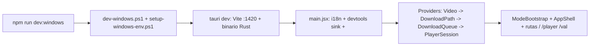
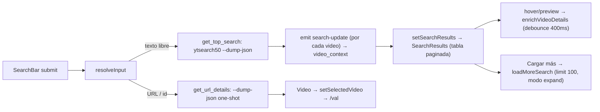
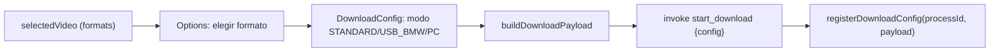
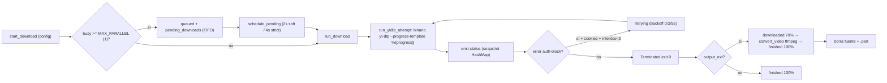
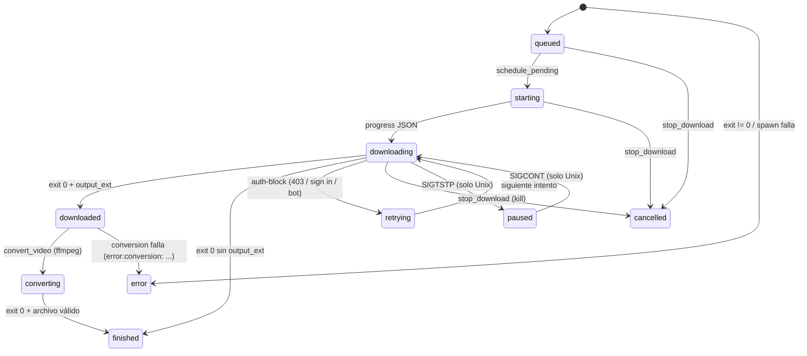
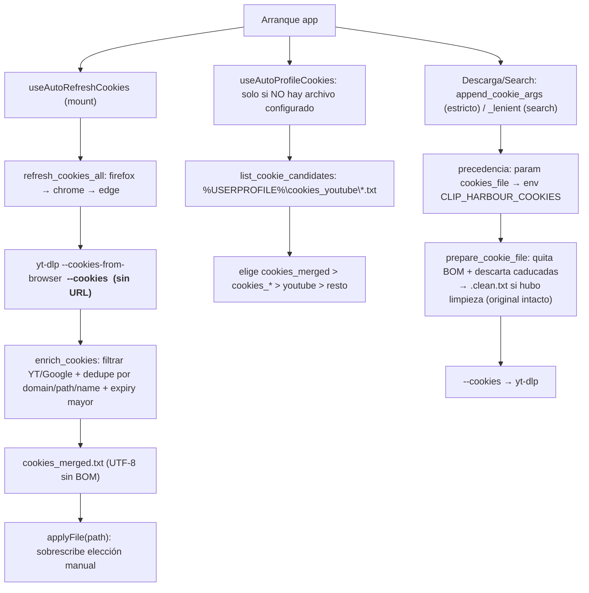
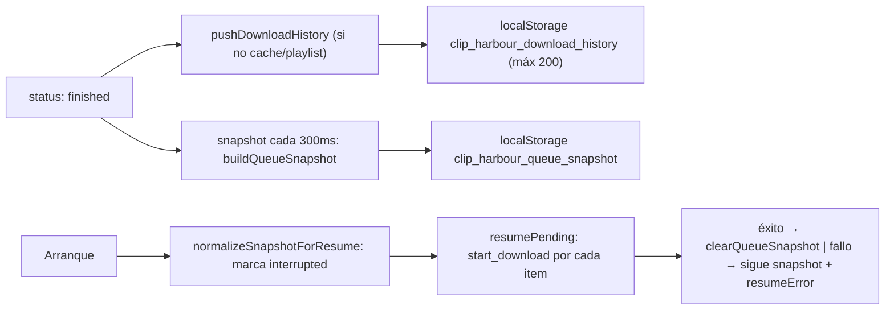

# Auditoría del flujo de descarga (arranque → búsqueda → descarga)

> Documento de auditoría progresiva. Estado por fase. Referencias a archivo:línea reales.
> Verificación en vivo: relanzamiento del 2026-08-22 18:54–19:10 UTC.

## FASE 1 — Arranque

### Flujo

### Paso a paso

1. `npm run dev:windows` → [dev-windows.ps1](dev-windows.ps1): `$ErrorActionPreference="Stop"`, dot-source [scripts/setup-windows-env.ps1](scripts/setup-windows-env.ps1), verifica sidecars `src-tauri\binaries\yt-dlp-*.exe` y `ffmpeg-*.exe`, ejecuta `scripts/tauri-windows.ps1 dev`.
2. `setup-windows-env.ps1`: PATH con `%USERPROFILE%\.cargo\bin`, `CARGO_HOME`/`RUSTUP_HOME`, `CARGO_TARGET_DIR=%LOCALAPPDATA%\clip_harbour-target`, localiza MSVC (msvcup portable → vcvars64 de VS/Build Tools con vswhere), importa vcvars, `INCLUDE` al Windows SDK, carga `.env` raíz (solo `CLIP_HARBOUR_*` y `VITE_*`).
3. `tauri-windows.ps1 dev`: valida `node_modules\.bin\tauri.cmd`, ejecuta el CLI Tauri. El CLI lanza `beforeDevCommand` (`npm run dev` → Vite en `:1420`) y `cargo run` del binario.
4. `lib.rs run()`: registra plugins `shell`, `opener`, `dialog`, `updater`, `process`; en `setup` gestiona `AppState` (process_registry, download_registry, pending_downloads, active_search, active_search_id) y `size_main_window_to_monitor` (75% del monitor, centrada). Registra `invoke_handler` con 11 comandos de producción + 17 solo-debug (incl. `devtools_log`).
5. Vite carga el frontend: `main.jsx` → importa `./i18n` (i18next, locale desde `src/lib/locale_prefs.js`) → `installDevtoolsConsoleSink()` → monta `<App/>` en StrictMode.
6. `App.jsx` monta providers en cascada: `VideoProvider` → `DownloadPathProvider` → `DownloadQueueProvider` → `PlayerSessionProvider` → `BrowserRouter` (`ModeBootstrap` redirige a `/player` si el modo guardado lo pide, `PlayerSessionLifecycle`, `AppShell` con rutas `/` `/player` `/val`).
7. Init de providers en mount: `DownloadQueueProvider` carga historial + snapshot de cola de localStorage y escucha `status`; `VideoProvider` escucha `search-update`; `PlayerSessionProvider` hace `reconcilePlaylist` + `purge_player_cache`.
8. En salida (debug): `RunEvent::Exit` → `clear_player_cache`; frontend `beforeunload` → `invoke("clear_player_cache")`.

### Huecos detectados

| Hueco | Impacto | Evidencia |
|---|---|---|
| Sink `devtools_log` no escribió en el relanzamiento | Bajo (solo dev) | [devtools_console.js](src/lib/devtools_console.js) guard `!isTauri() \|\| !import.meta.env.DEV`; `invoke` fire-and-forget con `.catch(()=>{})` traga errores. `scripts\devtools\logs\console` siguió en 242 líneas |
| Cookies del `.env` de otro usuario | Medio | `CLIP_HARBOUR_COOKIES=C:\Users\rodri\...` no existe → warning "skipping cookies" cada arranque ([ytdlp.rs](src-tauri/src/ytdlp.rs) `append_cookie_args_lenient`) |
| `clear_player_cache` fire-and-forget | Bajo | `PlayerSessionLifecycle` + `beforeunload`; si falla nadie se entera |

**Análisis del hueco del sink:** el código está bien cableado (se instala antes de montar React). La ausencia de líneas en `scripts\devtools\logs\console` tras el relanzamiento es esperable: el primer binario que corrió con el dump de 242 líneas **aún no tenía** el comando `devtools_log`; el segundo rebuild ya lo tenía, pero con `plus.jsx` corregido el arranque limpio no emite `console.*` (React no imprime nada sin warnings). Para confirmar el sink hay que generar tráfico: lanzar una búsqueda/descarga (emiten `console.error` en fallos) o un `console.log` puntual. **Pendiente de verificar en vivo.**

## FASE 2 — Búsqueda

### Flujo

### Paso a paso

1. `SearchBar` ([search_bar.jsx](src/components/search/search_bar.jsx)): sin debounce, busca solo en submit → `runSearch`. El dropdown de historial vive en [SearchHistoryDropdown.jsx](src/components/search/SearchHistoryDropdown.jsx).
2. `resolveInput` clasifica: URL/id pelado (11 chars) vs texto libre.
3. **Texto libre:** sentinel de carga + `invoke("get_top_search", { query, search_id, limit: 50, ...cookieInvokeArgs() })`. El retorno es `()`, los resultados llegan por el evento `search-update`.
4. Backend `get_top_search` ([ytdlp.rs](src-tauri/src/ytdlp.rs) 731-884): guarda `search_id`, **mata la búsqueda previa** (`active_search.kill()`), corre `yt-dlp ytsearchN:<query> --dump-json --no-playlist [cookies lenient]`, parsea JSON línea a línea, dedupe por videoId, emite `SearchUpdatePayload { search_id, results }` acumulado por cada video.
5. Frontend `video_context.jsx`: escucha `search-update`, filtra por `searchId`, dedupe por `videoKey`, `setSearchResults` (replace) o merge (expand).
6. `SearchResults` ([results.jsx](src/components/search/results.jsx)): tabla paginada (15 por página, adaptativo con ResizeObserver). Fila extraída a [ResultRow.jsx](src/components/search/ResultRow.jsx); preview con debounce 400 ms → `enrichVideoDetails` (invoca `get_url_details`, cachea en `detailsCacheRef`) en [PreviewPanel.jsx](src/components/search/PreviewPanel.jsx).
7. Abrir resultado: si no hay `formats` → `get_url_details` → `setSelectedVideo` → navega a `/val`.
8. **Cargar más:** `loadMoreSearch` reinvoca `get_top_search` con `limit: SEARCH_FETCH_MAX (100)` y `searchModeRef = "expand"`; `searchExpanded = true` al llegar a 100.

### Huecos detectados

| Hueco | Impacto | Evidencia |
|---|---|---|
| Sin rate-limit en búsquedas | Medio | `--sleep-requests` solo en descargas (`parse_config`); `ytsearch100` repetido puede tocar límite de YouTube; el error llega como `Err` genérico |
| `search-update` invisible en devtools | Bajo | No hay `console.log` en `video_context`; el tráfico de búsqueda no aparece en `scripts\devtools\logs\console` |
| Enter doble mata la búsqueda anterior sin feedback | Bajo | `active_search.kill()` en `get_top_search` ([ytdlp.rs](src-tauri/src/ytdlp.rs) 731+) |
| Error de búsqueda no distingue "sin resultados" vs "rate-limit" | Medio | `format_ytdlp_error` genérico con sugerencia de cookies |
| Techo duro de 100 resultados | Bajo | `SEARCH_FETCH_MAX = 100` ([search_constants.js](src/lib/search_constants.js)) |

## FASE 3 — Pantalla /val (configuración de descarga)

### Flujo

### Paso a paso

1. `selectedVideo.formats` alimenta `Options`; el usuario elige formato (`curr`).
2. `DownloadConfig` ([download_config.jsx](src/components/download/download_config.jsx)): `useEffect` resuelve `output_ext` según modo y `source_ext`; en USB_BMW fuerza `embed_metadata: true`.
3. `handleSubmit` (línea 81): valida solo `!String(downloadPath || "").trim()` (no existencia/escritura); decide bulk vs single (`shouldTreatAsBulk`); por cada target construye payload con [build_download_payload.js](src/lib/build_download_payload.js) (añade `output_dir`, `format`, `output_ext` = `sourceExt === formData.output_ext ? null : formData.output_ext`, y `cookieInvokeArgs()`).
4. `invoke("start_download", { config: payload })` → `processId`; `registerDownloadConfig(processId, payload)` guarda el config en un Map (para historial/resume).
5. Fallos por target se acumulan en `failures` y se muestran en el error; si todos fallan no navega.
6. `output_dir` viene del `DownloadPathContext` ([download_path_context.jsx](src/providers/download_path_context.jsx)): inicializa de localStorage (`clip_harbour_download_path`) o `VITE_DEFAULT_DOWNLOAD_PATH`; se persiste tal cual, sin validar.

### Huecos detectados

| Hueco | Impacto | Evidencia |
|---|---|---|
| **`output_dir` sin validar** (no existe / no escribible) | **Alto — causa del bug WinError 5** | [download_config.jsx](src/components/download/download_config.jsx) línea 84 solo comprueba `trim()`; [download_path.js](src/lib/download_path.js) no comprueba existencia; el error llega del lado Rust como `yt-dlp: ERROR: Unable to create directory: [WinError 5] Acceso denegado` |
| Sin comprobación de espacio en disco | Bajo | No hay nada en el flujo que lo consulte |
| `format` puede faltar si `get_url_details` no trae formats | Medio | `buildDownloadPayload` manda `format: formatId`; si es `undefined` y no es bulk, Rust usa default `bv*[height<=720]+ba/b` |
| Ruta guardada de otra sesión/usuario persiste | Medio | `download_path_context` lee localStorage sin verificar el usuario actual |

## FASE 4 — Descarga

### Flujo

### Diagrama de estados

### Paso a paso

1. `start_download` ([queue.rs](src-tauri/src/queue.rs) 147-183): `process_id = PROCESS_COUNTER.fetch_add(1)` (clave del registry, no hay campo `id`). Si `busy >= 1` → registry `queued` + `pending_downloads.push_back`; si no, `run_download`.
2. `schedule_pending` (215-227): gap de 2 s (soft) o 4 s (strict, env `CLIP_HARBOUR_YT_SLEEP`), luego `take_next_pending` (marca `starting`, emite `status`).
3. `run_ytdlp_attempt` (252-385): `parse_config` arma args ([ytdlp.rs](src-tauri/src/ytdlp.rs) 520+): URL, `--newline`, `--progress-template %(progress)j`, `--progress`, `--no-playlist`, cookies (`--cookies`/`--cookies-from-browser`), anti-rate-limit (0.75/1.5/4s), `--ffmpeg-location`, `-P <dir> -o <template>` (audio: `%(track,title).200B.%(ext)s`; cache/playlist: `%(id)s.%(ext)s`; keep: `%(title).200B.%(ext)s`), `-f <format>`, `--embed-metadata` en audio, etc. La ruta del binario sale de `binaries::resolve("yt-dlp")` (embebido → `%LOCALAPPDATA%\clip_harbour\bin\`, o copia junto al exe) y se lanza con `ShellExt::command`; registra `CommandChild` en `process_registry`.
4. Bucle `rx.recv().await`: cada línea JSON de `%(progress)j` → `merge_ytdlp_progress` (nunca confía en el `status` de yt-dlp; escala a 0-70% si habrá conversión) → `emit("status")`. Líneas con `ERROR` → status `error: <line>`.
5. `Terminated`: exit 0 + `output_ext` → `downloaded` @70%; exit 0 sin `output_ext` → `finished` @100%; exit != 0 → error.
6. Reintentos (`run_download` 387-440): `max_attempts = 3` si `download_has_cookies` si no 1; `can_retry = is_auth_block_error && attempt+1 < max_attempts`; `is_auth_block_error` matchea `403 | sign in to confirm | not a bot` ([ytdlp.rs](src-tauri/src/ytdlp.rs) 699).
7. Conversión `convert_video` (552-744): si `output_ext` y no purpose cache/keep/playlist; binario ffmpeg (`binaries::resolve("ffmpeg")`) con (`-c:a aac 256k` m4a, `libmp3lame -q:a 0` mp3, `-map_metadata 0`), progreso por `out_time=` (parsea HH:MM:SS), escala 70-100% (`map_convert_pct`). Éxito → renombra a `output_path`, `finished` @100%, borra fuente + restos `.webm/.opus/.ogg/.m4a.part/.webm.part`.
8. Frontend: `download_queue_context` escucha `status`, actualiza `downloads`, detecta transición a `finished` → historial (si no es cache/playlist); `loader.jsx` renderiza (barra, velocidad/ETA/tamaño, hint 403, botones pause/resume solo no-Windows, stop).
9. Acciones: `stop_download` (quita de pending, `kill()`, `cancelled`, borra entrada a los 5 s); `pause/resume` solo Unix (SIGTSTP/SIGCONT); `clear_finished_downloads` (retain).

### Huecos detectados

| Hueco | Impacto | Evidencia |
|---|---|---|
| **Sin timeout global**: yt-dlp colgado deja `downloading` indefinido | Medio | Bucle `while let Some(event) = rx.recv().await` ([queue.rs](src-tauri/src/queue.rs) 293) sin timeout |
| **Reintentos no re-extraen cookies**: 403 por cookies caducadas no dispara auto-refresh | Medio | `can_retry` solo matchea auth-block ([queue.rs](src-tauri/src/queue.rs) 431); no hay llamada a `refresh_cookies` |
| Pause/resume no soportados en Windows | Bajo | `nix` SIGTSTP/SIGCONT; frontend oculta botones (`loader.jsx` línea 9 `/Win/i`) |
| `merge_ytdlp_progress` ignora `status` de yt-dlp | Bajo | Por diseño; cambios de estado no cubiertos por el template JSON pueden desincronizar el UI |
| Sin conversión: archivo final solo confirmado por exit 0 | Bajo | No se verifica `is_file`/tamaño si no hay `output_ext` |
| Snapshot de cola sin idempotencia: relanzar puede re-descargar completados | Medio | `buildQueueSnapshot` filtra `finished/cancelled/error` del snapshot vivo, pero un cierre justo tras terminar puede dejar el config |

## FASE 5 — Cookies (revisión a fondo)

### Flujo de automatización

### Paso a paso

1. `use_auto_refresh_cookies` ([use_auto_refresh_cookies.js](src/hooks/use_auto_refresh_cookies.js)): single-flight anti-StrictMode; `invoke("refresh_cookies_all")`; en éxito llama `onSuccess(path)` y **solo aplica si no hay elección manual** (`loadCookiePrefs().cookiesFile` vacío).
2. `refresh_cookies_all` ([ytdlp.rs](src-tauri/src/ytdlp.rs) 557-571): itera `REFRESH_BROWSERS = ["firefox","chrome","edge"]`; primer éxito gana.
3. `refresh_cookies_from` (573-620): `resolve_cookies_dir(None)` (309-331) con precedencia `dir` → `CLIP_HARBOUR_COOKIES_DIR` → `%USERPROFILE%\cookies_youtube` (si tiene `.txt`) → `%APPDATA%\com.clip-harbour.app\cookies`; borra `cookies_raw_<b>.txt` (yt-dlp no sobrescribe `--cookies`); corre yt-dlp `--cookies-from-browser <b> --cookies <tmp>` sin URL (exit no fiable, valida por archivo); `enrich_cookies` → `cookies_merged.txt`; borra tmp.
4. `enrich_cookies` (465-540): `parse_cookie_line` (419-463) filtra dominios YT/Google (`is_youtube_domain` 405-416), normaliza flags (`TRUE` si dominio empieza por `.`), **descarta caducadas** (`expiry > 0 && expiry < now`), dedupe por `domain\tpath\tname` guardando la **expiry mayor**, valida sesión (SID/SSID/HSID/LOGIN_INFO/__Secure-3PSID), escribe con cabeceras y sin BOM. Si no hay sesión → error → `refresh_cookies_all` prueba el siguiente navegador.
5. `use_auto_profile_cookies` ([use_auto_profile_cookies.js](src/hooks/use_auto_profile_cookies.js)): solo si `loadCookiePrefs().cookiesFile` está vacío; `list_cookie_candidates` (348-403) puntúa y devuelve rutas absolutas; prefiere `cookies_merged.txt`.
6. `cookies_settings.jsx` monta ambos hooks y el botón **Actualizar cookies** (mismo `refresh_cookies_all` con single-flight) que muestra la ruta con "Abrir" en éxito o el error claro en fallo.
7. `cookieInvokeArgs()` ([cookies_prefs.js](src/lib/cookies_prefs.js)): siempre manda `cookies_file` (de localStorage `clip_harbour_cookies_file`) y `cookies_from_browser: null`.
8. `append_cookie_args` (109-147): precedencia `param cookies_file` → env `CLIP_HARBOUR_COOKIES`; si el archivo no existe → **error estricto** (bloquea descarga); `prepare_cookie_file` (214-261) quita el BOM (vía `sanitize_cookie_path` 173-193) y **descarta cookies caducadas**, escribiendo `<name>.clean.txt` solo si eliminó alguna. `append_cookie_args_lenient` (149-156) para search/details: solo warning.

### Huecos detectados (importantes)

| Hueco | Impacto | Evidencia |
|---|---|---|
| ~~**Auto-refresh pisa la elección manual**~~ | ~~Alto~~ | **FIX:** `useAutoRefreshCookies` solo aplica si `loadCookiePrefs().cookiesFile` está vacío |
| `refresh_cookies_all` en cada arranque | Medio | Hasta 3 extracciones secuenciales en cada mount; fallo silencioso (sigue con archivo previo) |
| **Multi-usuario**: env `rodri` vs auto-refresh `nexux` | Alto | `.env` con `CLIP_HARBOUR_COOKIES=C:\Users\rodri\...` inexistente → warning "skipping cookies"; el auto-refresh escribe en `%USERPROFILE%` de `nexux` |
| ~~`enrich_cookies` no filtra cookies caducadas~~ | ~~Medio~~ | **FIX:** descarta `expiry > 0 && expiry < now` en `enrich_cookies` y en `prepare_cookie_file` (ruta manual) |
| Mensaje de error y header Firefox-fijo | Bajo | "FireFox sin sesión?" y `# Source browser: <browser>` real, salvo el mensaje residual de sesión |
| `prepare_cookie_file`/`sanitize_cookie_path` crea copias | Bajo | `<name>.nobom.txt` / `<name>.clean.txt` junto al original, acumulable |
| ~~No hay auto-refresh ante 403 en descarga~~ | ~~Medio~~ | **FIX:** `run_download` llama a `refresh_cookies_all` antes de cada reintento |
| Frontend nunca manda `cookies_from_browser` | Bajo | `cookieInvokeArgs` fija `cookies_from_browser: null`; el fallback por navegador solo puede venir del env |

**Fixes propuestos (documentar, no implementar aún):**
1. ~~`useAutoRefreshCookies` solo aplica si no hay elección manual previa (flag `manual` en prefs o no pisar si `cookiesFile` existe).~~ **Implementado.**
2. ~~Filtrar cookies caducadas en `enrich_cookies` (`expiry == 0` o `expiry < now` → descartar).~~ **Implementado** (también en la ruta manual vía `prepare_cookie_file`).
3. Parametrizar el navegador ganador en la cabecera y en el mensaje de error.
4. ~~Ante auth-block con cookies, intentar `refresh_cookies` antes de reintentar la descarga.~~ **Implementado.**

**Estado de los fixes (2026-08-23):**
- **Implementado:** filtro de cookies caducadas en `enrich_cookies` (expiry > 0 y < now → descartada), validación de sesión (requiere SID/SSID/HSID/LOGIN_INFO/__Secure-3PSID; si no hay → error → `refresh_cookies_all` prueba el siguiente navegador), cabecera/error con el navegador real (`# Source browser: <browser>`), auto-refresh respeta elección manual, auto-refresh ante 403 en descarga, y `prepare_cookie_file` que limpia BOM + caducadas en la ruta manual. Tests: `enrich_cookies_drops_expired_and_keeps_session`, `enrich_cookies_rejects_without_session_cookie`, `enrich_drops_expired_st_cookies_like_session_logininfo`, `prepare_cookie_file_drops_expired_but_keeps_session`, `prepare_cookie_file_returns_same_path_when_nothing_expired` (19/19 en ytdlp).
- **Pendiente:** parametrizar el navegador ganador en la cabecera/mensaje (fix 3).

## FASE 6 — Persistencia

### Flujo

### Paso a paso

1. `download_queue_context` escucha `status` ([download_queue_context.jsx](src/providers/download_queue_context.jsx) 110-164): al pasar a `finished` (y no purpose cache/playlist) → `pushDownloadHistory` y borra el config. `cancelled`/`error` también borran el config.
2. `pushDownloadHistory` ([download_history.js](src/lib/download_history.js) 33-45): dedupe previo por `title + filename` (solo si `filename` existe), añade al inicio, recorta a 200.
3. Snapshot de cola: `useEffect` con debounce 300 ms llama `buildQueueSnapshot(configsRef, downloads)` y `saveQueueSnapshot` ([queue_snapshot.js](src/lib/queue_snapshot.js) 82-105): incluye configs con `url`, excluye purpose cache/playlist, excluye `finished/cancelled/error`, y conserva los `resumeItems` fallidos. **El config completo (con `output_dir`) viaja a localStorage.**
4. Al arrancar: `normalizeSnapshotForResume` (59-75) filtra items con `url` y deja solo `queued`/`interrupted`; `resumeItems` se muestra en el UI.
5. `resumePending` (75-104): por cada item `invoke("start_download", { config })`; si todos OK → `clearQueueSnapshot`; si hay fallos → guarda los restantes y muestra `resumeError`.

### Huecos detectados

| Hueco | Impacto | Evidencia |
|---|---|---|
| **El snapshot transporta `output_dir` inválido** (caso rodri/nexux) | **Alto** | `buildQueueSnapshot` serializa el `config` completo; `resumePending` re-lanza a rutas que pueden no existir |
| Sin idempotencia: re-descarga de completados | Medio | No hay comprobación de si el archivo destino ya existe antes de reintentar |
| Historial con dedupe parcial | Bajo | `pushDownloadHistory` dedupe solo por `title + filename`, nunca por URL; un mismo video con título distinto (tags) duplica |
| Snapshot guardado con debounce 300 ms | Bajo | Un cierre antes del timer pierde el último estado |

## FASE 7 — Pruebas de descarga

### Estado actual

- 51 tests vitest (solo `src/lib`), Rust tests en `ytdlp.rs` (parse_config, cookies), `e2e/smoke.spec.js` (solo UI Vite, sin IPC Tauri), `smoke-windows.ps1` (sidecars + vitest).
- **No hay tests de `queue.rs`** (0 coincidencias `#[test]`) ni ninguna prueba que ejecute yt-dlp end-to-end.

### Funciones confirmadas testables

- `queue.rs`: `clamp_pct` (43), `parse_pct_str` (47), `map_download_pct` (51), `map_convert_pct` (59), `format_pct` (63), `merge_ytdlp_progress` (67), `resolve_download_path` (92), `is_busy_status` (133).
- `ytdlp.rs`: `append_cookie_args` (79), `append_cookie_args_lenient` (118), `sanitize_cookie_path`/`has_utf8_bom` (129/142), `is_youtube_domain` (245), `parse_cookie_line` (259), `enrich_cookies` (304), `is_auth_block_error` (699), `download_has_cookies` (675).

### Plan de pruebas a implementar

1. **Unit Rust en `queue.rs`** (nuevo módulo `#[cfg(test)]`): escalas de porcentaje, `merge_ytdlp_progress` con línea JSON real, `resolve_download_path`, `is_busy_status`.
2. **Ampliar tests en `ytdlp.rs`**: `is_auth_block_error`, `download_has_cookies`, `enrich_cookies` con cookies caducadas, `sanitize_cookie_path` con BOM, `append_cookie_args` con archivo inexistente.
3. **Vitest de hooks de cookies** (`use_auto_refresh_cookies`, `use_auto_profile_cookies`): mock de `invoke`/`isTauri`, single-flight, auto-refresh no pisa selección manual (falla con comportamiento actual → documenta el hueco).
4. **Script `scripts/test-download.ps1`** (+ `npm run test:download`): yt-dlp + ffmpeg reales a temp dir.
5. **Ampliar `smoke-windows.ps1`**: descarga corta + `cargo test`.

### Estado de implementación (2026-08-23)

| Ítem | Estado | Resultado |
|---|---|---|
| Unit Rust `queue.rs` (9 tests) | Implementado | `clamp_pct`, `parse_pct_str`, `map_download_pct`, `map_convert_pct`, `format_pct`, `merge_ytdlp_progress` (con/sin conversión), `resolve_download_path` (x2), `is_busy_status` |
| Ampliar `ytdlp.rs` (6+ tests) | Implementado | `is_auth_block_error`, `download_has_cookies`, `append_cookie_args` estricto/lenient, `sanitize_cookie_path` con/sin BOM, `enrich_cookies` (caducadas + sesión + ST-*), `prepare_cookie_file` (con/sin caducadas) |
| `cargo test --lib` | **27/27 OK** | Ejecutado con MSVC (setup-windows-env.ps1) |
| Vitest hooks | Implementado | Lógica single-flight extraída a [auto_cookies_flight.js](src/hooks/auto_cookies_flight.js) (testeable sin DOM); 3 tests |
| `npm run test` | **85/85 OK** | 19 archivos (incluye `app_errors.test.js`) |
| Script integración | Implementado | [test-download.ps1](scripts/test-download.ps1) + `npm run test:download` (opt-in, requiere red) |
| Ampliar smoke | Implementado | [smoke-windows.ps1](scripts/smoke-windows.ps1) ahora corre `cargo test --lib`; test-download comentado por defecto |

**Nota sobre el hueco "auto-refresh pisa selección manual":** sin `@testing-library/react`/`jsdom` (no están en devDependencies) no se puede testear el componente `cookies_settings.jsx`. El hueco queda documentado en la Fase 5; la lógica single-flight compartida sí está cubierta por tests.

## Problemas observados en vivo (relanzamiento 2026-08-22 18:54–19:10 UTC)

| Problema | Detalle | Referencia |
|---|---|---|
| `output_dir` de otro usuario causa `WinError 5` | `C:\Users\rodri\Music\MEmu Music` (localStorage) mientras la app corre como `nexux` → `yt-dlp: ERROR: Unable to create directory: [WinError 5] Acceso denegado` | Fase 3 |
| Cookies multi-usuario | `.env` `CLIP_HARBOUR_COOKIES=C:\Users\rodri\...` inexistente → warning "skipping cookies"; auto-refresh escribe en `%USERPROFILE%` de `nexux` | Fase 5 |
| Sink `devtools_log` sin escribir | `logs\console` siguió en 242 líneas (en `scripts\devtools\logs`); esperable porque el arranque limpio (con `plus.jsx` corregido) no emite `console.*` y el binario que hizo el dump aún no tenía el comando | Fase 1 |

## Verificaciones pendientes

- Confirmar el sink `devtools_log` en vivo: lanzar una búsqueda/descarga (emite `console.error` en fallos) y ver `scripts\devtools\logs\console` crecer.
- Ejecutar `npm run test:download` (requiere red) para validar yt-dlp + ffmpeg end-to-end.
- Reproducir el `WinError 5` con el `output_dir` inválido persistido para confirmar el fix propuesto (validar la ruta en `download_path_context`/`download_config`).
