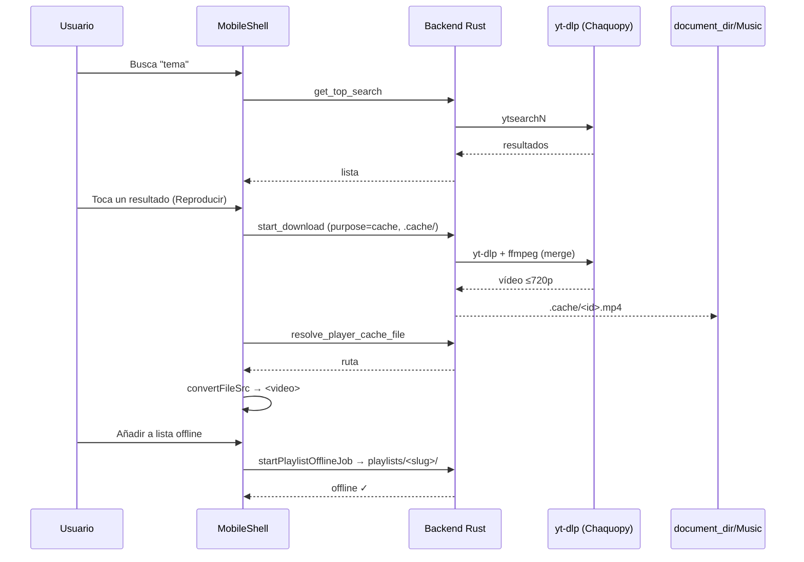
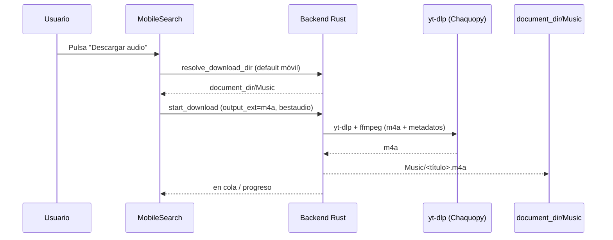

# Clip Harbour móvil (Android)

App Android del fork, **limitada a las funciones de música** (modo Player): búsqueda,
cache offline, playlists y descarga de audio. El escritorio (vista Descarga) no se toca.

- [Setup del toolchain y firma de APK → MOBILE_SETUP.md](./MOBILE_SETUP.md)
- [Veredicto del spike de factibilidad → MOBILE_SPIKE.md](./MOBILE_SPIKE.md)
- Estado del plan de implementación: fases `m0`…`m8` (commits `feat(mobile): …`).

## Arquitectura

```
+---------------------------+
|  WebView (React)          |
|  src/App.jsx → MobileShell|
|  (bottom nav: Buscar |    |
|   Cola | Playlists |      |
|   Ajustes)                |
+------------+--------------+
             | @tauri-apps/api (invoke)
+------------v--------------+
|  Rust backend (Tauri 2)   |
|  lib.rs, ytdlp.rs,        |
|  queue.rs, player_cache.rs|
|  files.rs, binaries.rs    |
+------------+--------------+
             | std::process::Command (ffmpeg) · Chaquopy (yt-dlp)
+------------v--------------+
|  Almacenamiento app       |
|  document_dir/Music       |
|   ├─ .cache/   (efímero)  |
|   └─ playlists/ (offline) |
+---------------------------+
```

### Componentes

| Pieza | Dónde | Notas móvil |
| --- | --- | --- |
| Shell móvil | `src/components/mobile/*` | Bottom nav sustituye a titlebar+sidebar. Solo se activa con `isMobile()` (UA Android/iOS). |
| Router | `src/App.jsx` | `HashRouter` en móvil (`tauri://localhost`), `BrowserRouter` en desktop. |
| Reproducción | `player_session_context.jsx` | `<video>` nativo, **primer plano únicamente**. |
| Cache efímero | `player_cache.rs` (`document_dir/Music/.cache`) | Persiste entre sesiones en móvil (no se borra en `endSession`/`beforeunload`). |
| Offline | `playlists/` por slug + `promote_to_playlist` | Cada playlist es una carpeta con `id.mp4` + `.archive.txt`. |
| Audio descargado | `document_dir/Music` (`resolve_download_dir`) | M4A + metadatos; sin MediaStore (no aparece en otras apps de música). |
| Cookies | `app_data_dir()/cookies` | Solo importar `cookies.txt` (no hay `--cookies-from-browser` en móvil). |
| Binarios | `jniLibs/libffmpeg.so` + Chaquopy (yt-dlp) | `externalBin` no existe en Android; `ffmpeg` se ejecuta desde `nativeLibraryDir`. **Chaquopy aún no está cableado** en el proyecto Gradle (pendiente, ver `MOBILE_SPIKE.md`). |

### Flujo de datos (reproducción offline)



### Flujo de datos (descarga de audio)



## Limitaciones (MVP)

- **Solo Android.** iOS queda fuera de alcance (toolchain, firma y sidecars distintos).
- **Sin Play Store / firma propia**: distribución por **sideload** (APK firmado con el
  keystore local; ver [MOBILE_SETUP.md](./MOBILE_SETUP.md)).
- **Reproducción solo en primer plano**: el `<video>` nativo no mantiene audio con la
  pantalla apagada ni muestra notificación de media. Un `MediaSession`/foreground service
  sería un plugin nuevo (pendiente).
- **Sin MediaStore**: las pistas viven en `document_dir/Music` (gestión de la app) y no
  aparecen en otras apps de música. Decisión del MVP (scoped storage).
- **Sin selector de carpetas ni "Abrir carpeta"**: no aplican en Android; los Ajustes
  muestran las rutas gestionadas por la app (`mobile_default_dirs`).
- **Cookies solo por importación** (`cookies.txt` Netscape). La extracción desde
  navegadores de escritorio no existe en móvil.
- **`yt-dlp` vía Chaquopy** (Python embebido): no hay binario standalone de `yt-dlp`
  para Android. **Pendiente de implementar** en el proyecto Gradle
  (`src-tauri/gen/android`); el backend Rust ya tiene la API dual (`Bin::Sidecar`).
  Ver [MOBILE_SPIKE.md](./MOBILE_SPIKE.md).

## Desarrollo y smoke

Prerrequisitos (una vez): toolchain portable en `%USERPROFILE%\toolchain-android`
(JDK 17 + SDK + NDK + targets Rust), `jniLibs/libffmpeg.so` y **Windows Developer Mode**
(el CLI Tauri crea un symlink del `.so` en `jniLibs`; ver `MOBILE_SETUP.md`):

```powershell
npm run fetch:sidecars:android
npm run tauri:android -- dev          # build + instalación en emulador/dispositivo
```

Verificaciones rápidas:

```powershell
npm test                    # unitarios (incluye helpers móviles)
npm run test:e2e            # Playwright desktop + viewport móvil (e2e/mobile.spec.js)
npm run check:rust          # cargo check desktop
cargo check --target aarch64-linux-android   # (con env toolchain Android cargado)
```

> El e2e móvil usa el dispositivo `Pixel 7` de Playwright (UA Android), que activa el
> shell móvil sin necesidad de un dispositivo físico.

## Base de datos de código clave

- `src/lib/tauri_env.js` — `isMobile()` (UA) decide el shell.
- `src/components/mobile/MobileShell.jsx` — layout móvil con bottom nav.
- `src/providers/player_session_context.jsx` — reproducción/cache; gates móviles
  (`endSession`/`prune_player_cache` no borran cache en móvil).
- `src-tauri/src/player_cache.rs` — rutas portables vía `app.path().document_dir()`.
- `src-tauri/src/files.rs` — `open_path`, `pick_download_dir`, `mobile_default_dirs`.
- `src-tauri/src/ytdlp.rs` — `default_download_dir`/`resolve_download_dir` portables;
  `refresh_cookies_from` gateado (móvil → error claro).
- `src-tauri/src/queue.rs` — `pause/resume` gateado `all(unix, not(android))`.
- `src-tauri/src/binaries.rs` — `Bin::{Path, Sidecar}` para resolución dual de binarios.
