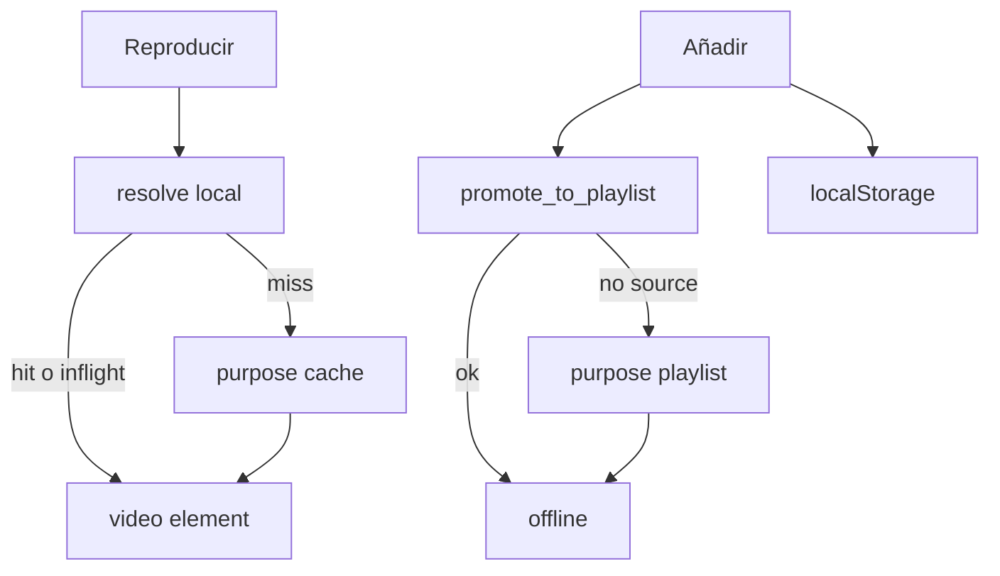

# Player + playlists (Clip Harbour)

Fuente de verdad operativa del modo Player, listas offline y límites YouTube/yt-dlp.  
Complementa [phase4/SPEC.md](./phase4/SPEC.md) (MVP) con el estado **post-MVP** ya en código y una **propuesta de implementación** siguiente.

**Relacionado:** [PHASE4.md](./PHASE4.md) · [PHASE4_SETUP.md](./PHASE4_SETUP.md) · [TROUBLESHOOTING.md](./TROUBLESHOOTING.md) · [cookies/cookies_info.md](./cookies/cookies_info.md)

---

## 1. Producto

| Modo | Ruta | Rol |
|------|------|-----|
| Descarga | `/` | Cola yt-dlp + historial + carpeta de descarga |
| Player | `/player` | Buscar, listas locales, play por archivo, Descargar audio/vídeo |

- Mismo `.exe` (Tauri 2). Preferencia: `localStorage` `clip_harbour_app_mode`.
- **Play:** no iframe YouTube, no P2P. Disco → `convertFileSrc` → `<video>`.
- **Cola de sesión (sidebar izquierda):** cada **Reproducir** añade a la cola efímera; Next/Prev y prefetch operan sobre ella. Se limpia al salir de Player.
- **Listas guardadas (panel derecho):** solo al **Añadir** (offline en `playlists/<slug>/`). No se llena con solo Reproducir.

---

## 2. Carpetas

Base: `CLIP_HARBOUR_PLAYER_DIR` o default `C:\Users\<user>\Music\MEmu video`.

| Path | Uso | Ciclo de vida |
|------|-----|----------------|
| `.cache/` | Play efímero (prev / now / next) | `clear_player_cache` al salir de Player / cerrar app |
| `playlists/<slug>/` | Offline por lista (`%(id)s.mp4`) | Hasta quitar ítem o borrar lista |
| raíz (keep) | `purpose: "keep"` — Descargar vídeo | Permanente |
| Carpeta Descarga (sidebar) | Audio / descargas modo Descarga | Permanente |

Asset protocol: scope `Music/**` (incluye `playlists/`).

---

## 3. Modelo FE (`clip_harbour_playlists`)

```js
{
  activeId: "default",
  names: { default: "Lista", Rock: "Rock" },
  lists: {
    default: [{ id, title, url, thumbnail, uploader, duration?, offline? }]
  }
}
```

- `id` de lista = **slug** de carpeta (Windows-safe).
- `offline: true` cuando hay copia en `playlists/<slug>/` (o tras `promote`).
- Código: [`src/lib/playlists.js`](../src/lib/playlists.js).

---

## 4. Comandos Rust

[`src-tauri/src/player_cache.rs`](../src-tauri/src/player_cache.rs)

| Comando | Rol |
|---------|-----|
| `player_cache_dir` / `player_keep_dir` | `.cache` / keep |
| `playlist_dir` / `resolve_playlist_file` | carpeta lista / archivo |
| `promote_to_playlist` | copia cache→lista sin re-hit YouTube |
| `delete_playlist_file` / `delete_playlist_dir` / `rename_playlist_dir` | limpieza |
| `resolve_player_cache_file(videoId, activeSlug?)` | activa → cualquier playlist → `.cache` → keep |
| `prune_player_cache` | solo MP4 fuera de ventana; **no** borra `.part` |
| `clear_player_cache` / `purge_player_cache` | wipe / temps; **no** toca `playlists/` |

---

## 5. `purpose` y cola

| purpose | Destino | Cola UI | Historial |
|---------|---------|---------|-----------|
| `cache` | `.cache/%(id)s.mp4` | oculto | no |
| `playlist` | `playlists/<slug>/%(id)s.mp4` | oculto | no |
| `keep` | keep por título | visible | sí |
| (normal) | carpeta Descarga | visible | sí |

- `MAX_PARALLEL_DOWNLOADS = 1` ([`state.rs`](../src-tauri/src/state.rs)).
- Gap **4 s** entre jobs en cola ([`queue.rs`](../src-tauri/src/queue.rs)).
- yt-dlp: `--sleep-requests 1.5`, `--min-sleep-interval 2`, `--max-sleep-interval 6`.

---

## 6. Sesión Player (comportamiento)

[`src/providers/player_session_context.jsx`](../src/providers/player_session_context.jsx)

| Acción | Comportamiento |
|--------|----------------|
| **Reproducir** | No añade a lista. Resolve local → si falta, un job `cache`. Reutiliza **inflight** del mismo `videoId`. |
| **Añadir** | Meta + promote si hay cache; si no, job `playlist` o pending-promote tras cache. |
| **Quitar** | Meta + borra archivo en carpeta de lista (+ cache id). |
| **Prefetch** | Solo siguiente; solo si **0** jobs activos. |
| **Salir Player** | Limpia `.cache` solamente. |

Inflight: `videoId → { processId, purpose }` → como máximo una descarga por vídeo.



---

## 7. Límites YouTube (investigación)

Fuente: [yt-dlp wiki Extractors](https://github.com/yt-dlp/yt-dlp/wiki/Extractors)

| Sesión | ~vídeos/h | ~req webpage/player/h |
|--------|-----------|------------------------|
| Guest | ~300 | ~1000 |
| Cuenta (cookies) | ~2000 | ~4000 |

Error: *Video unavailable… rate-limited… up to an hour*.  
Recomendación wiki: **5–10 s** entre descargas (`-t sleep`). Nuestros sleeps actuales son más cortos; subirlos si el límite vuelve.

Cookies: export estable (ventana privada → `robots.txt` → export → cerrar). Ver [cookies_info.md](./cookies/cookies_info.md).  
Riesgo: abusar cookies de cuenta principal puede banearla.

Playlists nativas YT (`list=`): yt-dlp recomienda archive + sleeps + secuencial. **Clip Harbour no importa `list=` todavía**; las listas son locales.

Patrones de players offline (Spotify-like / Jellyfin): índice meta + blobs en disco + play local-first + prefetch cancelable — alineado con nuestro diseño.

---

## 8. Checklist rate-limit

1. Esperar ~1 h; no martillar búsqueda/play.  
2. Reproducir solo ítems **offline** o ya en disco.  
3. Cookies frescas si hace falta.  
4. Tras recuperar: un play/add a la vez.  
5. Si persiste: subir sleeps a 5–10 s (propuesta §9).

---

## 9. Propuesta P10 — estado de implementación

| ID | Estado | Notas |
|----|--------|-------|
| P10a Rate-limit | **hecho** | `CLIP_HARBOUR_YT_SLEEP=soft\|strict` (default strict); gap cola 4/8 s; banner; prefetch opt-in |
| P10b Offline | **hecho** | `list_playlist_video_ids`, reconcile al seleccionar; `.archive.txt`; estados offline/guardando/pendiente |
| P10c UX | **hecho** | Crear inline; menú ⋯ rename/vaciar/borrar; badge preparación |
| P10d Import YT | parking | Sin cambios |
| P10e Docs | **hecho** | Este doc + SETUP / TROUBLESHOOTING |

### Detalle implementado (referencia rápida)

- Env: `CLIP_HARBOUR_YT_SLEEP=soft` (default) o `strict`. **Play/cache no aplica sleeps** (arranque rápido); gap cola 2/4 s.
- Prefetch: checkbox en cabecera lista; default off; se apaga al detectar rate-limit.
- Comandos nuevos: `list_playlist_video_ids`, `clear_playlist_media`, `append_playlist_archive`.

### No hacer (sigue vigente)

- Subir `MAX_PARALLEL` a 2 en Player mientras YouTube limite.  
- Auto-Añadir / auto-offline en Reproducir.  
- Borrar `playlists/` en `clear_player_cache`.  
- Prune que elimine `.part`.

---

## 9b. Propuesta original (archivo histórico)

<details>
<summary>Texto de diseño previo (P10a–e)</summary>

Objetivo: endurecer Player/listas frente a YouTube **sin** romper modo Descarga ni el contrato actual de carpetas.

Orden sugerido: P10a → P10b → P10c → P10e → P10d (opcional).

</details>
---

## 10. Archivos clave

| Área | Path |
|------|------|
| Listas | `src/lib/playlists.js` |
| Sesión | `src/providers/player_session_context.jsx` |
| UI | `src/player/PlayerPage.jsx` |
| Rust cache/listas | `src-tauri/src/player_cache.rs` |
| yt-dlp | `src-tauri/src/ytdlp.rs` |
| Cola | `src-tauri/src/queue.rs`, `state.rs` |
| Sidebar Player | `src/components/menu/sidebar.jsx`, `player_folder_panel.jsx` |

---

## 11. Referencias externas

- [yt-dlp Extractors wiki](https://github.com/yt-dlp/yt-dlp/wiki/Extractors) — rate limit, cookies  
- [yt-dlp playlists guide](https://yt-dlp-yt-dlp.mintlify.app/guides/playlists)  
- [yt-dlp cheat sheet](https://www.ditig.com/yt-dlp-cheat-sheet)  
- [Issue #11426](https://github.com/yt-dlp/yt-dlp/issues/11426) — rate limit en listas largas  
