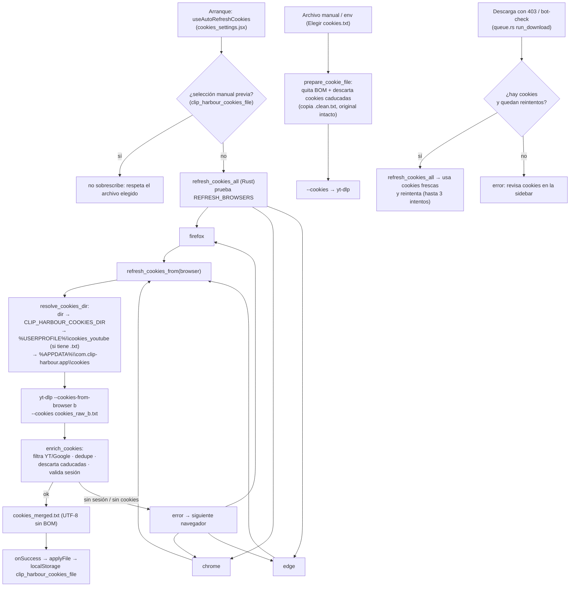

# Cookies de YouTube en Clip Harbour

Guía para usar cookies con **yt-dlp** desde Clip Harbour cuando YouTube bloquea búsquedas o descargas.

Referencia oficial: [Exporting YouTube cookies (yt-dlp wiki)](https://github.com/yt-dlp/yt-dlp/wiki/Extractors#exporting-youtube-cookies)

Setup rápido Fase 2: [PHASE2_SETUP.md](../PHASE2_SETUP.md).

---

## ¿Para qué sirven?

Las cookies permiten que **yt-dlp** actúe como si tuviera una sesión de navegador válida en YouTube. En Clip Harbour se usan en:

- Búsqueda (`get_top_search`)
- Detalle de URL (`get_url_details`)
- Descargas (`start_download`)

**No son obligatorias** para todo el contenido público. Sí suelen hacer falta cuando:

- Aparece *“Sign in to confirm you're not a bot”*
- El vídeo tiene restricción de edad
- Es contenido solo para miembros o listas privadas
- La búsqueda devuelve cero resultados sin error claro

---

## Cómo las configura la app (Fase 2)

En la **barra lateral** (sidebar expandida), sección **YouTube cookies**:

| Control | Qué hace |
|---------|----------|
| **Elegir cookies.txt** | En la cabecera (siempre visible). Abre un archivo `.txt` (formato Netscape) y pasa `--cookies <ruta>` a yt-dlp. |
| **Actualizar cookies** | En el panel. Ejecuta el auto-refresh (Firefox → Chrome → Edge), aplica el `cookies_merged.txt` generado y muestra su ruta con un botón "Abrir". |
| **Quitar archivo** | En el panel. Borra la ruta guardada. |
| **Abrir carpeta** | En el panel. Abre en el Explorador la carpeta de cookies de la app. |

La preferencia se guarda en `localStorage` (`clip_harbour_cookies_file`). Si existía una selección legacy “desde el navegador”, la app la limpia al abrir la sección para no enviar dos flags a yt-dlp.

### Backend (Rust)

`append_cookie_args` añade los argumentos a yt-dlp. Variables de entorno **antes de arrancar la app**:

| Variable | Equivalente |
|----------|-------------|
| `CLIP_HARBOUR_COOKIES` | Ruta al archivo `cookies.txt` |
| `CLIP_HARBOUR_COOKIES_FROM_BROWSER` | Nombre del navegador (`firefox`, `chrome`, …) — avanzado, sin UI |

Si hay archivo en la UI, el frontend **no** envía `cookies_from_browser`.

---

## Método A (recomendado / oficial Fase 2): exportar `cookies.txt`

YouTube **rota las cookies** si las exportas desde pestañas normales abiertas. yt-dlp recomienda:

1. Abre una ventana **privada / incógnito** e inicia sesión en YouTube.
2. En **esa misma pestaña** (y sin otras pestañas privadas abiertas), visita solo:  
   `https://www.youtube.com/robots.txt`
3. Exporta las cookies de `youtube.com` con una **extensión del navegador** (formato Netscape → archivo `.txt`).
4. **Cierra** la ventana privada.
5. Guarda el archivo fuera del repo y fuera de sync (p. ej. `%USERPROFILE%\cookies_youtube\cookies_chrome.txt`).
6. Clip Harbour → sidebar → **Elegir cookies.txt**.

### Lo que NO debes hacer

- **No** uses `--cookies COOKIEFILE --cookies-from-browser BROWSER` para *generar* el archivo desde incógnito.
- No uses la plantilla del repo como cookies reales: [`cookies.txt.example`](./cookies.txt.example).
- Extensiones: [FAQ de yt-dlp](https://github.com/yt-dlp/yt-dlp/wiki/FAQ#how-do-i-pass-cookies-to-yt-dlp).

---

## Avanzado: cookies desde el navegador (sin UI)

El desplegable “Desde el navegador” está **oculto** en Fase 2. Para forzarlo sin archivo, usa `CLIP_HARBOUR_COOKIES_FROM_BROWSER` en el entorno del proceso. En Windows, Chrome/Edge suelen fallar; Firefox suele ser más fiable. Preferible siempre el archivo `.txt`.

---

## Pipeline de enriquecimiento automático

El flujo completo (arranque → `cookies_merged.txt` seleccionado) está cableado así:

### Pasos en detalle

1. **Frontend** (`[use_auto_refresh_cookies.js](../../src/hooks/use_auto_refresh_cookies.js)`): al arrancar, llama a `refresh_cookies_all` protegido por `singleFlight` (StrictMode no dispara llamadas duplicadas).
2. **Guarda de selección manual**: el callback `onSuccess` en `cookies_settings.jsx` comprueba `loadCookiePrefs().cookiesFile`. Si el usuario ya eligió un archivo (esta sesión o una anterior), el refresh **no lo sobrescribe**; solo aplica la ruta nueva cuando no hay selección previa. Lo mismo hace `useAutoProfileCookies` (autodetección de archivo, solo cuando no hay nada configurado).
3. **Backend** (`refresh_cookies_all`): itera `REFRESH_BROWSERS = [firefox, chrome, edge]`. El primero que produzca cookies YouTube/Google gana; si todos fallan, se conserva el archivo previo (`cookies_merged.txt` que ya existiera en la carpeta destino) y se devuelve su ruta, para que la app **siempre tenga un TXT funcional** aunque el refresh no consiga leer el navegador.
4. **`refresh_cookies_from(browser)`**:
   - Resuelve la carpeta de destino con `resolve_cookies_dir` (precedencia: `dir` explícito → `CLIP_HARBOUR_COOKIES_DIR` → `%USERPROFILE%\cookies_youtube` **solo si tiene `.txt`** → `%APPDATA%\com.clip-harbour.app\cookies`).
   - Borra el temporal `cookies_raw_<browser>.txt` (yt-dlp no sobrescribe `--cookies`).
   - Ejecuta `yt-dlp --cookies-from-browser <browser> --cookies <tmp>` **sin URL**: el proceso sale non-zero ("You must provide at least one URL") incluso en éxito, así que el resultado se valida por **contenido del archivo**, no por exit code.
5. **`enrich_cookies`** (el corazón del enriquecimiento):
   - Mantiene solo dominios **YouTube/Google** (`is_youtube_domain`: youtube, google, googlevideo, ytimg, ggpht, gstatic).
   - **Dedupe** por `domain\tpath\tname` conservando la expiración más reciente.
   - **Descarta caducadas** (`expiry > 0` anterior a ahora), para que un jar muerto no cuente como válido.
   - **Valida sesión**: exige al menos una cookie de sesión (`SID`, `SSID`, `HSID`, `LOGIN_INFO`, `__Secure-3PSID`). Sin ella devuelve error y se prueba el siguiente navegador — esto explica por qué un archivo con solo cookies anónimas (`GPS`, `VISITOR_*`, `YSC`…) se rechaza.
   - Escribe `cookies_merged.txt` en **UTF-8 sin BOM** con cabecera `# Source browser: <navegador>`.
6. **`onSuccess`** en la UI recibe la ruta absoluta y la persiste en `localStorage` (`clip_harbour_cookies_file`), que es lo que después consume `cookieInvokeArgs` para cada búsqueda/descarga.
7. **Archivo manual / env también se limpia**: `append_cookie_args` usa `prepare_cookie_file` (antes solo `sanitize_cookie_path`). Además de quitar el BOM, **descarta cookies caducadas** (`expiry > 0` anterior a ahora, conservando sesión `expiry 0`). Si eliminó alguna, escribe una copia `<name>.clean.txt` sin tocar el original; si no, usa el archivo tal cual. Aplica a búsquedas, detalles y descargas.
8. **Refresh automático ante 403 en descarga**: en `queue.rs`, `run_download` reintenta hasta 3 veces cuando hay cookies y el error es de auth (403 / bot-check, vía `is_auth_block_error`). Antes de cada reintento llama a `refresh_cookies_all` y actualiza `config.cookies_file` con las cookies frescas, de modo que un 403 por cookies caducas se resuelve sin intervención del usuario.

### Dónde quedan los archivos (routing de escritura)

| Archivo | Carpeta | Rol |
|---------|---------|-----|
| `cookies_raw_<browser>.txt` | misma carpeta destino | temporal, se borra al terminar |
| `cookies_merged.txt` | la misma carpeta destino | archivo final que se selecciona |
| `<nombre>.nobom.txt` | junto al archivo manual | copia sin BOM (si aplica) |
| `<nombre>.clean.txt` | junto al archivo manual | copia sin cookies caducadas (si aplica) |

La carpeta destino por defecto es `%APPDATA%\com.clip-harbour.app\cookies\` (dentro de la app, per-user y fuera de sync). La legada `%USERPROFILE%\cookies_youtube\` se usa mientras contenga `.txt` para no romper configuraciones existentes.

---

## Riesgos y buenas prácticas

> **Advertencia (yt-dlp):** usar tu cuenta con yt-dlp puede conllevar **bloqueo temporal o permanente** de la cuenta.

- Usa cookies **solo cuando haga falta**.
- Considera una **cuenta secundaria** si descargas mucho.
- Mantén **yt-dlp actualizado**: `npm run fetch:sidecars:windows`

---

## Errores frecuentes

### “Sign in to confirm you're not a bot”

1. Reexporta cookies (método incógnito + extensión).
2. Configúralas en la sidebar.
3. Actualiza yt-dlp si el error persiste.

> **Auto-refresh (desde este fork):** al arrancar, la app extrae cookies de sesión probando **Firefox → Chrome → Edge** (con `yt-dlp --cookies-from-browser`), genera automáticamente `cookies_merged.txt` (filtradas solo para YouTube/Google, dedupe y UTF-8 sin BOM) con la primera que tenga sesión activa y lo selecciona. También puedes forzarlo con el botón **Actualizar cookies** del panel. Los archivos generados se guardan **dentro de la app** en `%APPDATA%\com.clip-harbour.app\cookies\` (aunque mientras exista la carpeta legada `%USERPROFILE%\cookies_youtube` con `.txt`, se sigue usando esa). Si el error 403 persiste tras el arranque, prueba a cerrar/reabrir la app, iniciar sesión de nuevo en el navegador (Firefox es el más fiable) o usa un archivo `cookies.txt`.

En descargas, la cola reintenta automáticamente los errores 403/bot-check **hasta 3 intentos** si hay cookies configuradas, refrescando las cookies del navegador antes de cada reintento (ver [Pipeline de enriquecimiento automático](#pipeline-de-enriquecimiento-automático)).

### “This content isn't available, try again later”

Rate limit de YouTube. Espera o reduce la frecuencia.

### “No search results” / búsqueda vacía

Puede ser cookies inválidas, query sin resultados, o bloqueo. Prueba cookies + otra búsqueda + yt-dlp reciente.

### OAuth

**El login OAuth de YouTube ya no funciona con yt-dlp.** Usa cookies (archivo).

---

## PO Token (YouTube reciente)

Las cookies **no sustituyen** un PO Token. Ver [PO Token Guide](https://github.com/yt-dlp/yt-dlp/wiki/PO-Token-Guide). Clip Harbour no expone PO Token en la UI.

---

## Resumen rápido (Windows)

1. Firefox → ventana privada → login YouTube → `youtube.com/robots.txt` → exportar `cookies.txt`.
2. Clip Harbour → sidebar → **Elegir cookies.txt** (o **Actualizar cookies** para extraerlas del navegador, o deja que el auto-refresh las extraiga al arrancar).
3. Si sigue fallando: `npm run fetch:sidecars:windows` y reintenta.
4. Setup Fase 2: [PHASE2_SETUP.md](../PHASE2_SETUP.md) · contexto fork: [WINDOWS.md](../WINDOWS.md).

---

## Flujos completos

### A. Arranque de la app (automatización total)

1. `main.jsx` → `App` → `CookiesSettings` monta.
2. `useAutoRefreshCookies`: si **no hay** selección manual previa → `refresh_cookies_all` (single-flight).
3. Backend: Firefox → Chrome → Edge; `enrich_cookies` escribe `cookies_merged.txt`.
4. `useAutoProfileCookies`: solo si sigue sin haber archivo configurado, escanea la carpeta y elige el candidato más probable.
5. Resultado persistido en `localStorage` (`clip_harbour_cookies_file`).
6. Búsqueda/descarga consumen esa ruta vía `cookieInvokeArgs`; cualquier archivo manual pasa por `prepare_cookie_file` (quita BOM y descarta caducadas).
7. El botón **Actualizar cookies** ejecuta el mismo `refresh_cookies_all` bajo demanda y muestra la ruta con "Abrir".

### B. Descarga con bloqueo de YouTube

1. `run_download` (queue.rs) lanza yt-dlp con `--cookies <ruta>`.
2. Si el error es 403 / bot-check (`is_auth_block_error`) y quedan intentos:
   - `refresh_cookies_all` → cookies frescas → actualiza `config.cookies_file` → reintenta.
3. Si se agotan los intentos sin cookies o sin sesión → estado `error: ...` en la UI.

### C. Rutas y archivos

| Ruta | Contenido |
|------|-----------|
| `%APPDATA%\com.clip-harbour.app\cookies\cookies_merged.txt` | destino final (por defecto) |
| `%APPDATA%\com.clip-harbour.app\cookies\cookies_raw_<browser>.txt` | temporal, se borra |
| `%USERPROFILE%\cookies_youtube\*.txt` | legado: se usa mientras tenga `.txt` |

---

## Comandos

| Comando | Qué hace | Uso cookies |
|---------|----------|-------------|
| `npm run dev:windows` | App dev (Vite + Tauri, consola visible) | ejecuta auto-refresh al arrancar |
| `npm run launch:windows` | Lanzador con splash (prefiere release) | ídem |
| `npm run test:download` | Integración real yt-dlp + ffmpeg (requiere red) | verifica descarga con/sin cookies |
| `npm run smoke:windows` | Smoke completo (vitest + `cargo test --lib` + checks) | valida `enrich_cookies` y helpers |
| `npm run test` | Vitest (unit JS) | hooks de cookies |
| `npm run check:rust` | `cargo check` | backend |
| `npm run fetch:sidecars:windows` | Descarga yt-dlp/ffmpeg actualizados | actualizar extractor |
| `npm run filter:cookies` | `scripts/filter-youtube-cookies.ps1` (manual, legacy) | filtrar/unificar manualmente |

Scripts directos:

| Script | Qué hace |
|--------|----------|
| `scripts/setup-windows-env.ps1` | Entorno MSVC + carga `.env` (CLIP_HARBOUR_*) |
| `scripts/test-download.ps1` | La base de `npm run test:download` |
| `scripts/smoke-windows.ps1` | La base de `npm run smoke:windows` |
| `scripts/filter-youtube-cookies.ps1` | Filtro manual YouTube/Google (legacy, ya no es necesario) |

Variable de entorno: `CLIP_HARBOUR_COOKIES_DIR` para cambiar la carpeta de escaneo/escritura; `CLIP_HARBOUR_COOKIES` para fijar un archivo concreto; `CLIP_HARBOUR_COOKIES_FROM_BROWSER` para forzar navegador.

---

## Enlaces útiles

- [Extractors — Exporting YouTube cookies](https://github.com/yt-dlp/yt-dlp/wiki/Extractors#exporting-youtube-cookies)
- [FAQ — How do I pass cookies to yt-dlp?](https://github.com/yt-dlp/yt-dlp/wiki/FAQ#how-do-i-pass-cookies-to-yt-dlp)
- [PO Token Guide](https://github.com/yt-dlp/yt-dlp/wiki/PO-Token-Guide)
