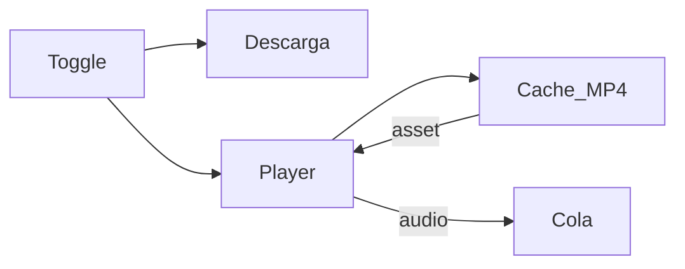

# Fase 4 — SPEC

Fuente de verdad técnica. El [master](../PHASE4.md) solo enlaza y recoge cierres.

## Definición

| | `/` Descarga | `/player` |
|--|--|--|
| UI | Densa | Ligera; sidebar compacta |
| Media | `download_path` | `%TEMP%\clip_harbour\cache` ≤720p → play → LRU 1 GB |
| CTA | Configurar | **Descargar audio** → cola `bestaudio` + historial |
| Default | Sí | Opt-in `localStorage` (`clip_harbour_app_mode`) |

**Fuera MVP:** P2P, iframe YT, stream directo, historial reproducidos, bulk/formatos en Player.

**Parking:** stream googlevideo; historial reproducidos; calidad >720p.



## Decisiones

| Tema | Decisión |
|------|----------|
| Play | `convertFileSrc` + CSP `media-src 'self' asset: http://asset.localhost blob:` |
| Merge | yt-dlp `bv*[height<=720]+ba/b` + ffmpeg → MP4 en cache |
| Cola | `purpose=cache`, max 2 compartido, **sin** historial; UI “en espera” |
| Click search | play / add; **nunca** `/val` |
| Playlists | `localStorage` `clip_harbour_playlists` |
| Cache | LRU 1 GB; purge huérfanos al entrar Player |
| Puente P3→P5 | Context `PlayerSession`: `requestPlay(video)` / `nowPlaying`; P3 puede encolar intent antes de P5 |
| Puente P3→P6 | `addToPlaylist(item)` no-op seguro hasta P6 (API estable) |
| i18n | Toggle en P1; resto Player en P8 |
| CHANGELOG | Solo P0 y P9 |

## Ownership

| ID | Rutas |
|----|-------|
| P0 | `docs/PHASE4*`, `docs/phase4/**`, `docs/README.md`, `CHANGELOG_FORK.md` |
| P1 | `App.jsx`, `titlebar.jsx`, `lib/app_mode.js`, i18n toggle, stub `/player` |
| P2 | `src/player/**` chrome; sidebar compacta |
| P3 | Search wiring Player; no `file_desc`/formats |
| P4 | `src-tauri/**` cache; `tauri.conf.json` CSP; capabilities asset |
| P5 | Play FE, LRU/prefetch UI |
| P6 | `lib/playlists.js` + UI lista |
| P7 | Bridge CTA → `download_queue_context` |
| P8 | TROUBLESHOOTING, i18n resto, tests |
| P9 | `PHASE4_AUDIT.md`, checklist final, CHANGELOG cierre |

## Ritual

Ningún P* hecho sin esto:

1. DoD + ownership  
2. Cierre en `P*.md` (3–5 líneas)  
3. Pegar en [PHASE4.md §Cierres](../PHASE4.md) + mapa → hecho  
4. Checklist  
5. PR `phase4(P#): …` (Summary, links, Test plan); `#N` en P* y master  
6. CHANGELOG solo si P0 o P9  

**DoD ritual (casillas en cada P*):**

- [ ] Ownership  
- [ ] Cierre P*  
- [ ] Master actualizado  
- [ ] PR 1:1 + `#N` (o `pendiente`)  
- [ ] Checklist  
- [ ] CHANGELOG si P0/P9  

## Gate

```powershell
npm test
npm run smoke:windows
npm run check:rust   # P4+
```
